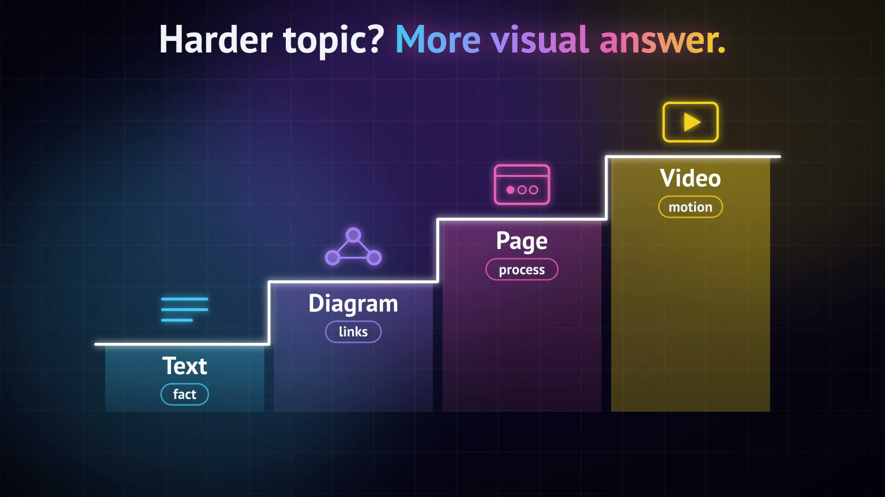

**English** | [Русский](README.ru.md)

# m3m-explain

An agent skill that explains anything — code your agent wrote, a concept, a paper, an idea — and picks the best form for it: **text → diagram → animated page → video**. The harder the topic, the more visual the answer.

https://github.com/user-attachments/assets/e43edced-7121-4fc0-a83c-e1d91495a77f

*13-second demo, sound on. Vertical Russian version: [README.ru.md](README.ru.md).*

## Why

The idea comes from [Andrej Karpathy](https://x.com/karpathy/status/2105819303471976479): models now write more than we can read, so our job shifts to understanding their output. A wall of text is the weakest way to do that. For hard material each step up is "even better": a diagram beats a paragraph, an interactive page beats a diagram, and a 3Blue1Brown-style video beats them all when the idea is about motion or change.

m3m-explain turns that into a ladder your agent follows on every "explain" request.

| Level | When | What you get |
|---|---|---|
| 1. Text | a simple fact, a definition, one cause, a command | a short plain-language answer |
| 2. Diagram | one link that is easier to see: order, cause, dependency | a self-contained HTML diagram |
| 3. Animated page | steps, paths, states, a whole system | an HTML page with a step player and animations |
| 4. Video | the core is motion or transformation | a silent video with sound effects (HyperFrames) |

<p align="center"></p>

The skill announces the level it chose. An explicit format wins ("in 5 sentences", "draw it", "make a video"). "I don't get it" moves exactly one step up. Video is always offered first and never built without a yes, unless you asked for a video.

## Installation

### 1. Install the skill

One command (macOS or Linux):

```bash
curl -fsSL https://raw.githubusercontent.com/hydra8/m3m-explain/main/install.sh | bash
```

Or from a clone:

```bash
git clone https://github.com/hydra8/m3m-explain.git
cd m3m-explain
./install.sh
```

### 2. Choose where it goes

| Agent | Folder | Flag |
|---|---|---|
| Claude Code | `~/.claude/skills/m3m-explain` | `--target claude` |
| Codex, Pi and other agents that read `~/.agents/skills` | `~/.agents/skills/m3m-explain` | `--target agents` |
| Both | both folders | `--target all` |

Without `--target`, the installer copies the skill into every one of these folders that already exists. If none exists, it creates `~/.claude/skills`. With `curl`, pass flags after `bash -s --`:

```bash
curl -fsSL https://raw.githubusercontent.com/hydra8/m3m-explain/main/install.sh | bash -s -- --target all
```

### 3. Optional: the video level

Levels 1–3 work out of the box. Level 4 needs the [HyperFrames](https://github.com/heygen-com/hyperframes) skills by HeyGen (Apache-2.0):

```bash
./install.sh --with-video
# or: curl -fsSL https://raw.githubusercontent.com/hydra8/m3m-explain/main/install.sh | bash -s -- --with-video
```

This runs the official HyperFrames installer (`npx hyperframes skills update` and `npx hyperframes skills update faceless-explainer`). The video level also needs **Node.js 22+**, **ffmpeg / ffprobe** and **Chrome or Chromium**. The installer only warns if something is missing; it never installs system packages.

### 4. Check that it works

```bash
ls ~/.claude/skills/m3m-explain/SKILL.md   # or ~/.agents/skills/m3m-explain/SKILL.md
```

Start a new agent session and ask: *"explain how a hash map works"*. In Claude Code you can also call `/m3m-explain`.

### 5. Update or remove

- **Update:** run the installer again. It replaces the old copy.
- **Remove:** `./install.sh --uninstall` (or `curl … | bash -s -- --uninstall`). HyperFrames is left alone.
- **See what would happen:** add `--dry-run`.
- **skills CLI:** the skill lives in `skills/m3m-explain/`, so `npx skills add hydra8/m3m-explain` should also find it (not tested by us).

## Usage

Just ask. Examples and where they usually land:

| Request | Level |
|---|---|
| "What is idempotency?" | 1 — text |
| "Draw how a request goes through nginx, the backend and the database" | 2 — diagram |
| "How does a compiler turn source code into machine code?" | 3 — page, plus a one-line video offer |
| "Explain your diff" / "why did you do X?" | the main case — same ladder |
| "How does a wave travel along a string?" | 4 — video, after a yes |
| "I don't get it" | one step up |

The answer comes in the language of the request. English follows plain-English rules inspired by ASD-STE100 and is checked with `scripts/ste_score.py`; Russian follows plain-Russian rules and is checked with `scripts/ru_score.py`. Russian triggers work too: «объясни», «как работает», «что такое», «не понял».

A request to fix something ("fix it", "why does the test fail" while debugging) is not an explanation, so the skill stays out of the way.

## Where explanations are saved

Pages and videos go to `explanations/<slug>/` at the root of the current git project, or to `~/explanations/<slug>/` outside a project. Nothing is added to git; add `explanations/` to your `.gitignore` if you do not want to commit them.

## Requirements

- `python3` — page checks and text scoring (standard library only).
- Chrome or Chromium — page screenshots (optional; skipped if missing).
- Video level — Node.js 22+, ffmpeg, ffprobe, Chrome, HyperFrames skills (see step 3).

## Tests

```bash
python3 -m unittest discover -s tests
```

51 tests: the installer in a sandbox `HOME` (fresh install, existing folders, reinstall, a path with spaces, dry run, uninstall, `curl | bash` mode), the skill finder, the page checker, the sound-offset script, the text scorer and a check that no personal data is in the repo.

The demo videos were made with HyperFrames, the same engine the video level uses.

## Credits

- Idea: [Andrej Karpathy](https://x.com/karpathy/status/2105819303471976479).
- Ladder rules adapted from MIT skills: [claritymaxx](https://github.com/v60samurai/claritymaxx), [output-form-ladder](https://github.com/lklbar666/output-form-ladder), [explain-as-webpage](https://github.com/elliewlh2094/explain-as-webpage), [karpathy-output](https://github.com/ohernandezdev/karpathy-output), [eli5](https://github.com/mblode/agent-skills).
- Video engine: [HyperFrames](https://github.com/heygen-com/hyperframes) by HeyGen (Apache-2.0), installed separately.
- `ste_score.py` and `ru_score.py`: [oshnilia/claude-plugins](https://github.com/oshnilia/claude-plugins), `legible` plugin (MIT).
- Font: PT Sans (SIL Open Font License), bundled as "Explain Sans".
- Visual style of the video level: inspired by 3Blue1Brown.

Details: [skills/m3m-explain/CREDITS.md](skills/m3m-explain/CREDITS.md).

## License

[MIT](LICENSE)

## Changelog

- 2026-10-05 — first public release: the four-level ladder, installer with `--with-video`, English and Russian text rules, demo videos.
